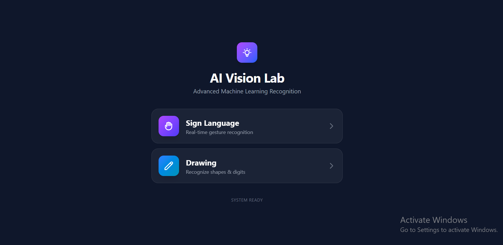
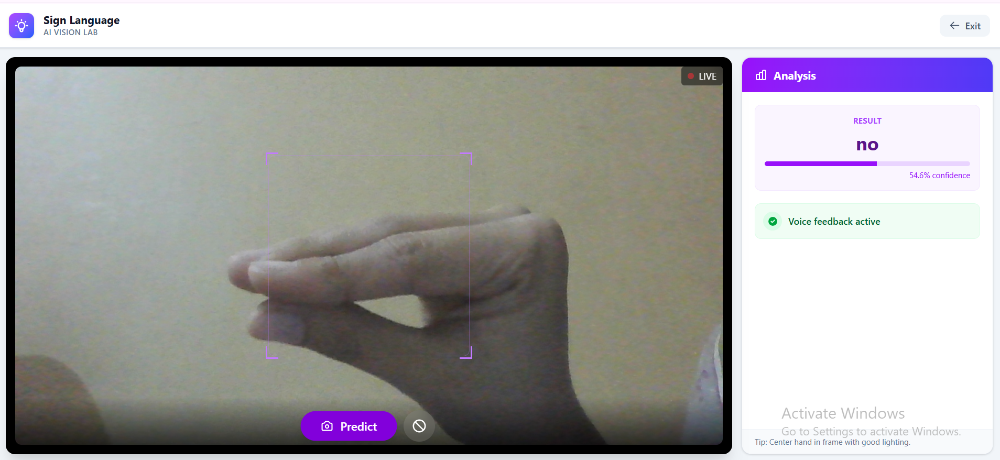
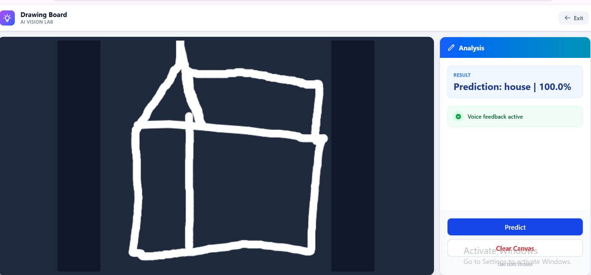

# 🧠 AI Vision Recognition System

### Sign Language Detection + Drawing Recognition Web App

A full-stack AI web application that recognizes:

✅ Hand Sign Language gestures using webcam  
✅ Hand-drawn sketches using canvas

Built using **Deep Learning + React + Flask + TensorFlow**

## 🚀 Project Overview

This system provides two intelligent vision modules:

### 🔹 1. Sign Language Predictor

- Uses webcam
- Detects hand gestures
- Classifies into trained sign classes
- Speaks prediction aloud

### 🔹 2. Drawing Recognition Board

- User draws on canvas
- AI predicts object (tree, house, umbrella, etc.)
- Real-time classification

## 🏗️ System Architecture

```
User (Browser)
     ↓
React + Tailwind Frontend
     ↓
Flask REST API (Backend)
     ↓
Deep Learning Models (.h5)
     ↓
Prediction → Response → UI
```

## 🧠 Models Used

### ✅ Sign Language Model

| Property                 | Value                    |
| ------------------------ | ------------------------ |
| Architecture             | EfficientNetB0           |
| Transfer Learning        | Yes (ImageNet)           |
| Input Size               | 224 × 224                |
| Classes                  | 6                        |
| Augmentation             | Rotation, Flip, Zoom     |
| Optimizer                | Adam                     |
| Loss                     | Categorical Crossentropy |
| Best Validation Accuracy | **96.94%**               |

Training result:

```
Validation Accuracy: 96.94%
```

### ✅ Drawing Recognition Model

| Property                 | Value            |
| ------------------------ | ---------------- |
| Architecture             | Custom CNN       |
| Input Size               | 32 × 32          |
| Classes                  | 3                |
| Dataset                  | QuickDraw subset |
| Normalization            | 0–1              |
| Optimizer                | Adam             |
| Best Validation Accuracy | **97.82%**       |

Training result:

```
val_accuracy: 97.82%
```

---

## 📂 Project Structure

```
AI-Vision-App/
│
├── frontend/          → React + Tailwind UI
│   ├── src/
│   ├── components/
│   └── package.json
│
├── backend/           → Flask API
│   ├── backend.py
│   ├── requirements.txt
│   ├── best_efficientnet_model.h5
│   ├── best_drawmodel.h5
│   └── class_indices.json
│
├── training/          → Google Colab notebooks
│   ├── sign_training.ipynb
│   └── drawing_training.ipynb
│   └── class_indices.json
│
└── README.md
```

## 🛠️ Technologies Used

### Frontend

- React (Vite)
- Tailwind CSS
- Canvas API
- Webcam API
- Axios

### Backend

- Flask
- Flask-CORS
- TensorFlow / Keras
- NumPy
- Pillow

### AI/ML

- EfficientNetB0 (Transfer Learning)
- Custom CNN
- Image Augmentation
- EarlyStopping
- ReduceLROnPlateau

## 👨‍💻 Author

**Hifza Sethi**

AI + Web Development Project  
Deep Learning + React + Flask

## 📜 License

This project is for educational and research purposes.

## 📸 Screenshots

### 🏠 Home



### ✋ Sign Language Detection



### ✏️ Drawing Recognition




Try IT: https://ai-recognition-system.vercel.app/
